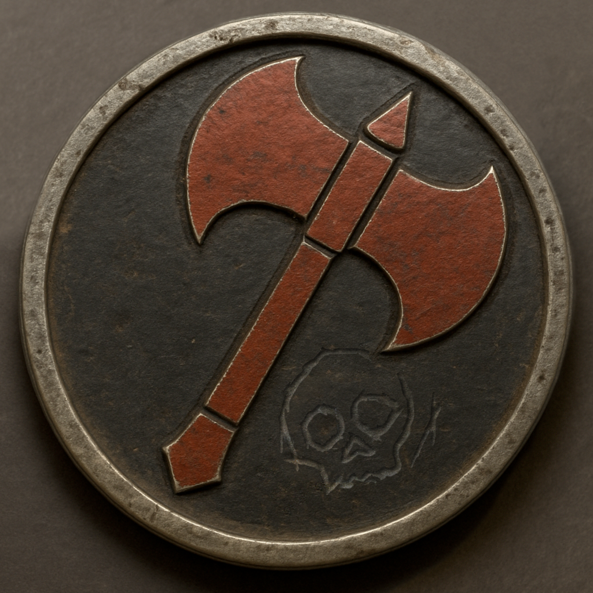

## Early Life & Military Service

Born to a human soldier and an elven scout, Vaelin Ashthorn grew up between two worlds never fully belonging to either. Their father, a hardened veteran, pushed them toward discipline and duty, while their mother taught them the ways of the wild, urging them to listen to their instincts above all else.

Vaelin **grew up in the shadow of the mountains** up in the north near Mirabar, where their elven mother, **Lyara Ashthorn**, made her home. While their father was often away on military campaigns, their mother taught them the ways of the wild – **tracking through rocky terrain, reading the sky for storms, and finding hidden paths that no army could march through.**

Among the peaks of the _»Spine of the World«_, Vaelin learned patience, endurance, and the value of **freedom**. They spent days climbing jagged cliffs, their feet finding sure purchase where others would slip. **In the solitude of the mountains, there were no distractions, no orders; just the wind, the stone, and the quiet strength of the earth beneath them.**

One lesson stayed with them most: _»The mountain does not yield to force, only to those who know how to walk its path.«_ Lyara’s words shaped how Vaelin approached life – **not with brute force, but with agility, strategy, and a deep respect for the land.**

Later Vaelin followed in their fathers footsteps, enlisting in the military _»The Axe of Mirabar«_, believing they could make a difference from within.

When they joined, Vaelin’s knowledge of the mountains, their keen eyes and quick reflexes, made them invaluable on the battlefield. They served as a **scout and pathfinder**, leading troops through treacherous highland passes and setting ambushes where the terrain gave them an advantage. **They could disappear into the rock and snow like a ghost, striking from unseen vantage points.**

But Vaelin had never belonged easily, even among their own. For a long time they were a curiosity: a half-elf with a quiet voice, a sharp eye, and a neither wholly masculine nor wholly feminine appearance. Many in the ranks didn’t know what to make of them. Some whispered behind their back, others offered condescending reassurances they hadn’t asked for. Vaelin accepted none of it. They never apologised for who they were.

Where others relied on brute strength or loud bravado, Vaelin earned respect another way: through discipline, skill, and an unwavering conviction that no uniform could erase who they were at heart. They never understood the blind obedience of their comrades – **they questioned orders, argued with officers, and risked insubordination** when commands put civilians or prisoners in unnecessary danger. They out-scouted veterans twice their age, found safe passages through high mountain passes, and saved more than one patrol from an ambush with their calm, precise archery.

It was during those early campaigns that Vaelin came to know Commander Dain Varros, a seasoned officer. Unlike many officers, Dain neither questioned their capability nor their identity. When others stumbled over what to call Vaelin, Dain was the first to simply ask. And when Vaelin answered »*them*« Dain nodded once and never forgot.

In that, and in many other things, Dain stood apart. Under Dain’s leadership, Vaelin found purpose, believing that perhaps there was a way to serve without losing themselves to cruelty.

But war is rarely so simple.

---

## The Breaking Point

### The Workers’ Village

It was set to be just another regular mission and began like so many others – under torchlight and the hollow assurances of nobles who had never lifted a sword. The uprisings had spread to the mines, and a nearby workers’ village had declared for the rebels, barricading the roads in a desperate bid for fair wages and less brutal conditions.

When Vaelin and their unit arrived, the air was thick with fear and smoke. The fighting was vicious but brief. By dawn, the barricades had burned to ash, and the rebels, most little more than tired labourers, had surrendered. They laid down their makeshift arms and begged for mercy.

Vaelin could never forget the way the dawn light caught the fear in their faces. Nor the way Grudvan Seabone’s – the leading general – voice stayed so steady when he gave the order:

»*No prisoners. No mercy.*«

At that moment, something inside Vaelin broke.

They stepped forward without thinking, demanding Seabone to reconsider. They argued, calm at first, then with the quiet fury of someone who could not abide cruelty dressed up as duty. For once their reputation meant nothing!

The other soldiers shifted uneasily, waiting for Commander Dain to step in. But Dain only met Vaelin’s gaze – silent, steady, their jaw set in that way Vaelin knew meant he also would not bend.

Dain turned to the general, voice measured but resolute.

»*I will not carry out this order.*«

### The Escape

Later, as the unit gathered in a makeshift square, Vaelin watched Dain kneel on the packed earth. For the first time since joining the Axe of Mirabar, they felt their hands tremble. This was not the justice they had sworn to uphold. This was not what the uniform meant.

When the geneal drew his sword, Vaelin moved.

They never remembered the exact sequence – only the shouting, the clash of steel, the look in Dain’s eyes when he realized what Vaelin intended.

They cut the bonds from Dain’s wrists, pulled him to his feet, and ran.

### The Final Stand

They made it as far as the treeline before the pursuit closed in. Dain, already wounded, pressed his insignia into Vaelin’s palm. A small, cold weight that felt heavier than any blade.

»*Someone has to remember.*« he told them. »*Someone has to live to remember the truth. Someone has to fight for what we stood for.*«

Vaelin wanted to protest, but Dain turned back, drawing his sword. For a heartbeat, their eyes met – an understanding passing between them without a word.

They were both done taking orders.

When Vaelin vanished into the mountain fog, the sounds of the final clash echoed behind them. Metal on metal, a cry of defiance. Dain held the line while Vaelin escaped, cutting through their pursuers until they fell. The last thing Vaelin saw before vanishing into the trees was their commander fighting alone, surrounded by enemies, refusing to kneel.

Dain’s body was never recovered, the only thing besides the memories Vaelin has to remember him by is his Military Insignia.

> A worn metal pin originally crafted in the style of the Axe of Mirabar. The design features a deep-red double-bladed axe with a pointed haft and a flaring, flat base, set against a black field. The axe is engraved in bold, clean lines, symbolizing the authority and power of Mirabar’s military. The metal surface is aged and slightly tarnished from years of use, with small nicks and scratches. Etched crudely across the lower portion of the axe, a small, stylized skull has been scratched directly into the metal, its lines rough and uneven, as if carved by hand with a blade or other tool. This mark stands in stark contrast to the precision of the official emblem, conveying a sense of personal loss, remembrance, or defiance. The insignia’s edges show signs of wear, hinting at many battles and the passage of time. The background is neutral to clearly display the details.

---

## The Aftermath – Life as a Wanderer

Branded a **deserter and traitor**, Vaelin fled into the highlands, **forsaking the military** they once served and evading pursuers with the same skill they had once used to guide their own forces. With no home to return to, they wandered from town to town, **protecting those who could not protect themselves** – mercenaries, slavers, and corrupt officials learned to fear the arrows that struck from the shadows.

Vaelin keeps **Dain’s insignia** as a reminder of the cost of doing what is right. **A part of them still wonders: could Dain have survived if they had fought harder?** That doubt, that guilt, fuels them. Their hatred for the military’s cruelty is now **blind and unreasoning** – they will never again bow to authority that values power over people.

They spend their nights **fletching their own arrows, a ritual to keep their hands steady and their mind focused.** They keep a **small, worn leather journal** where they write down the names of the lost, ensuring they are never forgotten.
