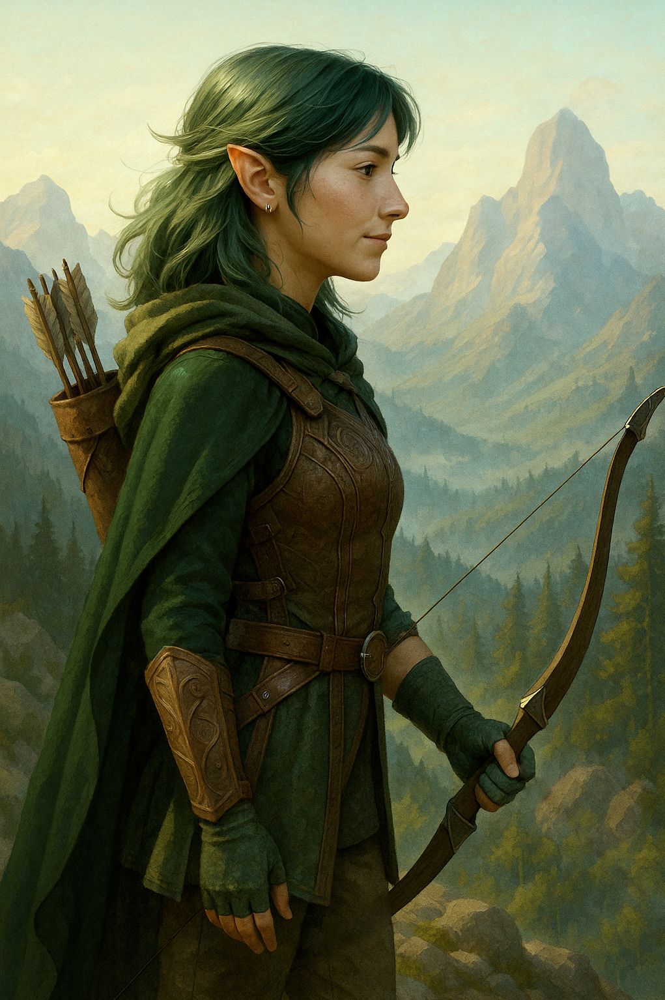
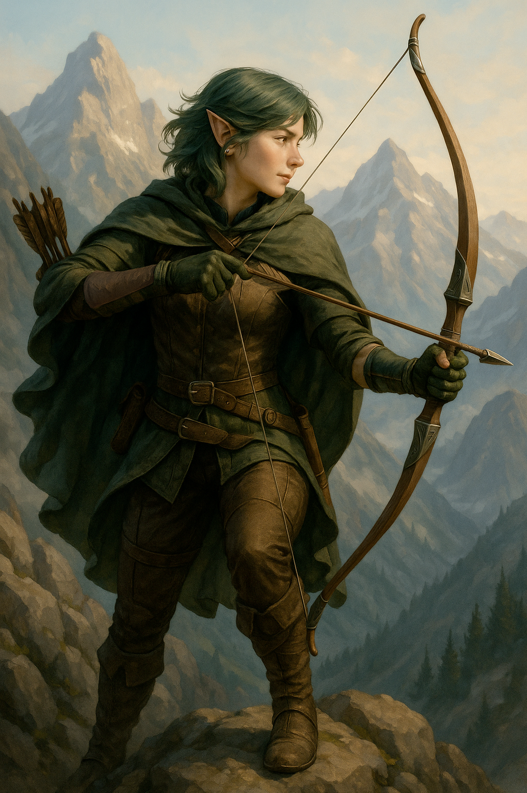

import ImageGrid from '../../../../components/ImageGrid.astro'

<ImageGrid columns='2'>

</ImageGrid>

## Personality Summary

- **Polite and respectful**—even to those they dislike, unless they prove truly cruel.
- **Doesn’t trust easily**—but once they do, they are fiercely loyal.
- **Hates blind obedience**—questions authority and refuses orders that go against their morals.
- **Fights for the weak**—driven by guilt and a strong moral code.
- **Blinded by hatred**—against those who remind them of the military’s worst aspects.
- **Still searching**—for closure, for proof, or perhaps for a cause that truly feels right.
